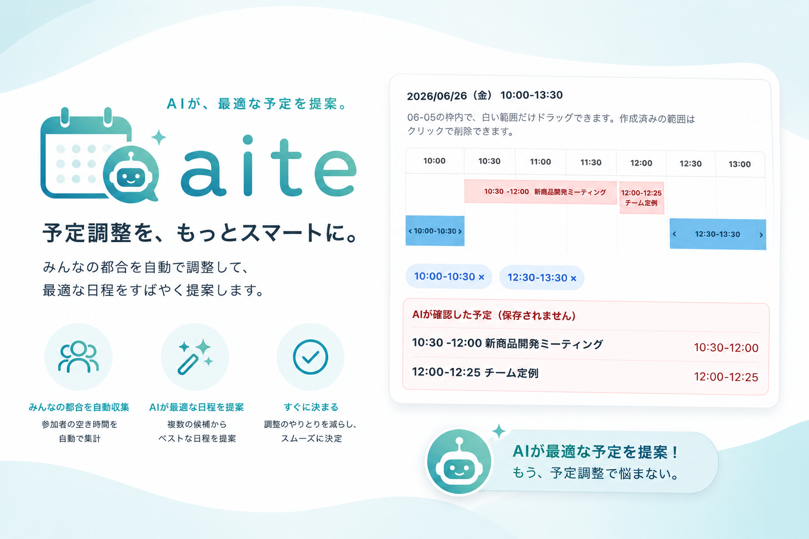

# カレンダーを見ながら日程調整表を埋めるのが、もうしんどかったので AI 前提の aite を作った

日程調整は、同じ組織のなかだけなら案外かんたんです。

たとえば Microsoft Teams や社内カレンダーを見れば、誰がいつ空いていそうかはすぐ分かる。会議を置く側も、参加する側も、同じ仕組みの上に立てているからです。

でも、そこに別の組織の人が入ってくると急に話が変わります。カレンダーは共有されていないし、相手の予定をこちらから確認するわけにもいかない。だから今も TonTon や調整さんのような日程調整サービスが使われ続けているのだと思います。

どちらも素晴らしいサービスです。アカウントを作らなくても、候補を並べて URL を送るだけで、関係者と日程を合わせられる。この気軽さは本当に大事です。

## ただ、候補が増えると急に苦しくなる

候補が 2 つか 3 つなら問題ありません。

でも候補日が何日もあり、それぞれに複数の時間帯があるとどうでしょう。自分のカレンダーと日程調整表を横に並べて、「この日は 13 時からなら大丈夫」「これは移動中だからだめ」「この予定はオンラインだから、もしかしたら参加できるかも」と、一つずつ記入していくことになります。

この作業、地味ですがかなり苦しい。

予定を確認するためにカレンダーを開く。日程調整表に戻る。間違いに気づいてまたカレンダーに戻る。候補が多いほど、単純な判断を何度も往復することになります。

<!-- スクリーンショット挿入: 候補日時を複数作成した aite のイベント作成画面。カレンダーと候補一覧が同時に見える状態。 -->

*候補日時を作る画面。時間帯を含む調整と、日付だけの調整の両方に対応しています。*

## だったら、AI を使う前提の UI にしてしまえばいいのでは？

いまは多くの人が、日常的に AI を使っています。

カレンダーを見て「この候補なら参加できる時間」を整理することは、まさに AI が得意な作業です。だったら日程調整サービスの側が、AI に渡しやすい情報と、AI から戻ってきた結果を受け取りやすい入口を最初から用意しておけばいいのではないか。そんな発想から作ったのが **aite** です。

aite はアカウント不要の日程調整サービスです。候補を作り、URL を共有し、回答者は自分の都合を入力します。ここまでは一般的な日程調整サービスと同じです。

違うのは、回答画面に「AIで一括入力」があることです。

候補日時と回答形式を含んだプロンプトをコピーして、普段使っている AI に渡す。返ってきた JSON を aite に貼り付けると、参加可能な時間帯がまとめて反映されます。

<!-- スクリーンショット挿入: 回答画面の「AIで一括入力」ボタンと、開いたモーダル。プロンプトのコピーと JSON 入力欄が見える状態。 -->

*AI に渡すプロンプトをコピーし、返答を貼り付けるだけで候補へ反映できます。*

AI が確認した予定は、単に「空いている」「空いていない」として捨てません。タイトルと時間を回答画面に表示するので、本人が最後に判断できます。「完全には空いていないけれど、この会議なら途中から参加できるかもしれない」といった余地も残せます。

## aite でできること

### 時間帯まで決める日程調整

作成者は月カレンダーから日付を選び、10 分単位で候補時間を作れます。最低必要時間も設定できるので、たとえば「30 分以上まとまって参加できる時間だけ」を回答してもらうことができます。

回答者は白い候補範囲をドラッグして、参加できる時間だけを指定します。すでに作った範囲はクリックで消せるので、手動での微調整も難しくありません。

<!-- スクリーンショット挿入: 回答画面で白い候補範囲をドラッグし、参加可能な時間が選択されている状態。 -->

### 日付だけ確認する日程調整

時間はまだ決めなくてよく、「参加できる日だけ知りたい」という調整もあります。aite では日程のみモードを選ぶと、回答者は空いている日を選ぶだけです。

このモードでも AI 一括入力を使えます。完全に空いていない日は参加可にせず、カレンダー上の予定を判断材料として残すこともできます。

### URL だけで共有できる

作成すると、回答 URL と管理 URL が発行されます。回答者にアカウントは必要ありません。回答を編集したいときは、自分で決めた名前と編集用パスワードで前回の回答を読み込みます。

作成者は管理 URL から集計を見たり、CSV をダウンロードしたりできます。ブラウザには最近開いたイベントへのリンクも残るので、「あの調整表どこだっけ」を少し減らせます。

<!-- スクリーンショット挿入: イベント管理画面。回答 URL / 管理 URL のコピー操作と、時間帯の集計が見える状態。 -->

## AI に任せるところ、人が決めるところ

aite は、AI が自動で予定を確定するサービスではありません。

面倒な照合を AI に手伝ってもらい、最終的な回答と判断は本人が行う。その役割分担を大切にしています。AI の出力もそのまま保存するのではなく、画面上で確認してから回答として送る形です。

日程調整は小さな作業ですが、関係者が増えるほど何度も発生します。カレンダーと表を往復する負担を少しでも減らせたらと思っています。

## 使ってみる

aite は PHP と SQLite だけで動く、小さな Web アプリとして公開しています。セルフホストもできます。

- GitHub: [TetsuakiBaba/aite](https://github.com/TetsuakiBaba/aite)
- README: [セットアップと機能の詳細](README.md)

日程調整の「確認して転記する」時間が少しでも軽くなるか、ぜひ試してもらえたらうれしいです。

---

#日程調整 #スケジュール調整 #AI活用 #生成AI #個人開発 #Webサービス #PHP #SQLite #オープンソース
